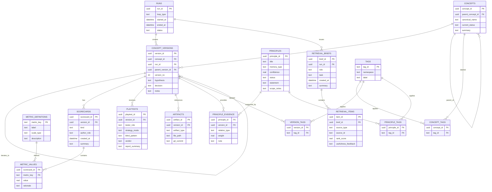

# Memory System ERD

```mermaid
erDiagram
    RUNS ||--o{ CONCEPT_VERSIONS : creates
    CONCEPTS ||--o{ CONCEPT_VERSIONS : has
    CONCEPTS ||--o{ CONCEPTS : parent_of
    CONCEPT_VERSIONS ||--o{ CONCEPT_VERSIONS : iterates_to
    CONCEPT_VERSIONS ||--o{ SCORECARDS : has
    SCORECARDS ||--o{ METRIC_VALUES : contains
    METRIC_DEFINITIONS ||--o{ METRIC_VALUES : defines
    CONCEPT_VERSIONS ||--o{ PLAYTESTS : receives
    CONCEPT_VERSIONS ||--o{ ARTIFACTS : references
    PRINCIPLES ||--o{ PRINCIPLE_EVIDENCE : supported_by
    CONCEPT_VERSIONS ||--o{ PRINCIPLE_EVIDENCE : provides
    RUNS ||--o{ RETRIEVAL_BRIEFS : issues
    RETRIEVAL_BRIEFS ||--o{ RETRIEVAL_ITEMS : contains
    TAGS ||--o{ CONCEPT_TAGS : applies
    CONCEPTS ||--o{ CONCEPT_TAGS : labeled
    TAGS ||--o{ VERSION_TAGS : applies
    CONCEPT_VERSIONS ||--o{ VERSION_TAGS : labeled
    TAGS ||--o{ PRINCIPLE_TAGS : applies
    PRINCIPLES ||--o{ PRINCIPLE_TAGS : labeled

    RUNS {
      uuid run_id PK
      text loop_type
      datetime started_at
      datetime ended_at
      text status
    }

    CONCEPTS {
      uuid concept_id PK
      uuid parent_concept_id FK
      text canonical_name
      text current_status
      text summary
    }

    CONCEPT_VERSIONS {
      uuid version_id PK
      uuid concept_id FK
      uuid run_id FK
      uuid parent_version_id FK
      int version_no
      text hypothesis
      text decision
      text notes
    }

    SCORECARDS {
      uuid scorecard_id PK
      uuid version_id FK
      text kind
      text author_role
      datetime created_at
      text summary
    }

    METRIC_DEFINITIONS {
      text metric_key PK
      text label
      text scale_type
      text description
    }

    METRIC_VALUES {
      uuid scorecard_id FK
      text metric_key FK
      real value
      text rationale
    }

    PLAYTESTS {
      uuid playtest_id PK
      uuid version_id FK
      text tester_role
      text strategy_mode
      text blind_pattern
      text verdict
      text report_summary
    }

    PRINCIPLES {
      uuid principle_id PK
      text title
      text memory_type
      real confidence
      text status
      text statement
      text scope_notes
    }

    PRINCIPLE_EVIDENCE {
      uuid principle_id FK
      uuid version_id FK
      text relation_type
      real weight
      text note
    }

    ARTIFACTS {
      uuid artifact_id PK
      uuid version_id FK
      text artifact_type
      text file_path
      text git_commit
    }

    RETRIEVAL_BRIEFS {
      uuid brief_id PK
      uuid run_id FK
      text role
      text task
      datetime created_at
      text summary
    }

    RETRIEVAL_ITEMS {
      uuid item_id PK
      uuid brief_id FK
      text source_type
      text source_id
      real rank_score
      text usefulness_feedback
    }

    TAGS {
      text tag_id PK
      text namespace
      text label
    }

    CONCEPT_TAGS {
      uuid concept_id FK
      text tag_id FK
    }

    VERSION_TAGS {
      uuid version_id FK
      text tag_id FK
    }

    PRINCIPLE_TAGS {
      uuid principle_id FK
      text tag_id FK
    }
```
