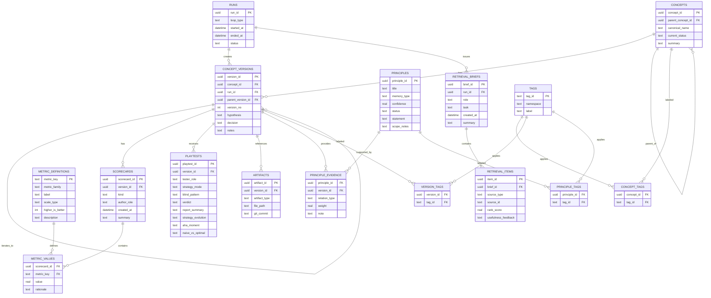

# Recursive Self-Improving Memory System Spec

Version: `v1`
Status: Draft
Canonical store: `SQLite`
Human review: `none`
Scope: `Puzzle Lab`, `LeetCode`, and shared game-design memory

Related artifact: [memory-erd.md](./memory-erd.md)

## 1. Purpose

This memory system exists to make the agent recursively self-improve at designing games.

The system must do more than persist notes. It must:

1. remember what was tried
2. compare outcomes across attempts
3. generalize scoped lessons from evidence
4. update belief strength over time
5. retrieve the right lessons for the next design/build/test decision
6. audit whether retrieval helped or hurt

The target loop is:

`retrieve -> predict -> act -> evaluate -> distill -> update beliefs -> audit retrieval -> repeat`

## 2. Goals

Primary goals:

1. reduce repeated mistakes across cycles
2. improve prediction accuracy over time
3. reduce iterations required to reach a keep-worthy game
4. increase keep rate without collapsing into one mechanic family
5. preserve transfer learning between `puzzle_lab` and `leetcode`

Secondary goals:

1. keep memory legible to humans through generated markdown
2. keep the playtester blind
3. keep the system deterministic enough to debug

## 3. Non-Goals

This system does not aim to:

1. store full source files or large transcripts in the database by default
2. replace git as the artifact store
3. use embeddings in `v1`
4. optimize for the minimum number of tables
5. support human review workflows

## 4. Core Design Decisions

1. One shared memory system with namespaces: `global`, `puzzle_lab`, `leetcode`
2. `SQLite` is the source of truth
3. Markdown is generated from the database for retrieval and inspection
4. The system starts from scratch with no backfill
5. Principle promotion and confidence updates are fully autonomous
6. The playtester is blind to lineage, prior metrics, and target intent
7. Retrieval is role-specific and budget-capped
8. Agent control documents must explicitly integrate the memory system

## 4.1 ERD



## 5. System Components

### 5.1 Memory Store

The canonical relational store containing structured memory objects.

### 5.2 Distiller

The subsystem that converts raw cycle data into:

1. candidate principles
2. anti-patterns
3. open questions
4. procedural lessons
5. evidence records

### 5.3 Belief Updater

The subsystem that:

1. recomputes confidence
2. changes principle status
3. applies decay
4. marks principles contested or deprecated when necessary

### 5.4 Retriever

The subsystem that:

1. selects relevant memories for each role
2. ranks them
3. enforces retrieval budgets
4. emits retrieval briefs

### 5.5 Retrieval Auditor

The subsystem that:

1. records whether retrieved memories were useful
2. adjusts future retrieval ranking inputs
3. tracks misleading memories

### 5.6 Markdown Renderer

The subsystem that generates human-readable summaries from the database.

### 5.6.1 Metric Design Policy

Metrics are not just implementation diagnostics. They are the system's evidence model.

The metric system must separate three questions:

1. does the artifact structurally fit the problem it claims to teach
2. does the intended strategy materially outperform the strongest plausible wrong strategy
3. does a blind human discover the intended invariant through play

This separation is required because one blended metric would hide the main failure mode of educational game design:

`the solver can do the right thing, but the player does not learn why`

For the `leetcode` namespace specifically:

1. engineer scorecards must store structural-fit and strategy-pressure metrics
2. designer-review scorecards must store blind-play learning metrics
3. playtest reports must preserve the player's strategy evolution and naive-vs-optimal framing as first-class evidence
4. no single `alignment` metric may stand in for both solver fit and player understanding

## 5.7 Control Document Integration

The memory system is not complete unless the agent instruction documents and loop orchestration documents are updated to use it.

In this spec:

1. `agents.md` means the primary agent instruction file if the repo uses that convention
2. `CLAUDE.md` is treated as the current repo's `agents.md` equivalent
3. `program.md` means the orchestration document for the design loop
4. `leetcode/program.md` is the algorithm-game orchestration document

The memory system must be wired into these documents, not treated as a sidecar utility.

These documents must be fully rewritten around the memory system, not patched incrementally.

Reason:

1. the old documents assume markdown-first memory and ad hoc learning files
2. the new system changes the loop order itself
3. the new system changes what each role may read and write
4. the new system introduces autonomous belief updates and retrieval audits
5. partial edits would leave conflicting workflow assumptions in the same document

## 6. Roles And Permissions

### 6.1 Designer

Can write:

1. concept hypotheses
2. decisions
3. candidate principles
4. anti-patterns
5. open questions

Can read:

1. relevant principles
2. anti-patterns
3. comparable concepts and versions
4. blind spots
5. retrieval warnings

### 6.2 Engineer

Can write:

1. implementation facts
2. scorecards
3. metric values
4. artifacts

Can read:

1. similar versions
2. procedural lessons
3. bug archetypes
4. metric thresholds
5. relevant principles that affect implementation

### 6.3 Playtester

Can write:

1. playtest reports
2. discovered strategy descriptions
3. verdicts

Can read:

1. stable evaluation rubric
2. session protocol
3. optional unrelated calibration examples

Cannot read:

1. concept lineage
2. prior metrics
3. target algorithm
4. prior decisions
5. expected strategy

### 6.4 Orchestrator

Can write:

1. runs
2. retrieval briefs
3. retrieval audits
4. evidence records
5. belief updates
6. confidence recomputations

## 7. Memory Object Model

The core memory objects in `v1` are:

1. `runs`
2. `concepts`
3. `concept_versions`
4. `scorecards`
5. `metric_definitions`
6. `metric_values`
7. `playtests`
8. `principles`
9. `principle_evidence`
10. `retrieval_briefs`
11. `retrieval_items`
12. `tags`
13. `artifacts`

## 7.0 Scorecard Design Rules

Every substantial evaluation should produce separate scorecards for separate epistemic roles.

Required pattern:

1. `predicted` scorecard:
   designer's pre-build expectations about structural fit, breakpoint, and likely failure mode
2. `actual` scorecard:
   engineer's measured implementation facts and solver-backed metrics
3. `designer_review` scorecard:
   post-playtest judgment about whether the intended invariant actually emerged for a blind player

Scorecards must not collapse these into one mixed bundle.

Reason:

1. predicted versus actual deltas are critical for memory learning
2. blind-play understanding must be stored separately from solver behavior
3. principle evidence is stronger when the system knows which role observed what

## 7.1 Required Rewrite Of Agent Instruction Files

The primary agent instruction file, whether `agents.md` or `CLAUDE.md`, must be rewritten to describe the memory system as part of the normal workflow.

This is a full-document rewrite requirement, not a partial edit requirement.

It must define:

1. the existence of the canonical memory store
2. the role-specific retrieval contract
3. what each role may write back into memory
4. the playtester blindness contract
5. the requirement to treat principles as scoped beliefs, not universal truths
6. the end-of-cycle distillation and retrieval-audit steps

### 7.1.1 Required `agents.md` or `CLAUDE.md` Behavior

The agent instructions must require that before any substantial task:

1. the designer reads a designer retrieval brief
2. the engineer reads an engineer retrieval brief
3. the playtester reads only the playtest protocol and rubric

The agent instructions must also require that after any completed cycle:

1. the system writes scorecards and playtests
2. the distiller emits candidate principles and evidence
3. the belief updater recomputes confidence and statuses
4. the retrieval auditor records usefulness feedback

### 7.1.2 Required `agents.md` or `CLAUDE.md` Role Notes

The instruction file must explicitly tell the system:

1. Designer:
   reads principles, anti-patterns, comparable concepts, and blind spots
2. Engineer:
   reads procedural memory, similar versions, bug archetypes, and thresholds
3. Playtester:
   must remain blind to concept history, metrics, and target intent
4. Orchestrator:
   is responsible for autonomous belief updates and retrieval audit

### 7.1.3 Required Rewrite Outcome

The rewritten `agents.md` or `CLAUDE.md` must no longer assume:

1. markdown files are the canonical memory store
2. memory updates happen informally
3. retrieval is optional rather than required
4. principles are static prose rather than autonomous belief objects
5. the playtester can share the same context model as the designer or engineer

## 7.2 Required Rewrite Of Program Documents

The orchestration documents, including `program.md` and `leetcode/program.md`, must be rewritten so the loop actually uses memory.

This is a full-loop rewrite requirement, not a step insertion requirement.

### 7.2.1 Required Loop Phases

Every loop document must contain these explicit phases:

1. `Retrieve`
2. `Predict`
3. `Act`
4. `Evaluate`
5. `Distill`
6. `Update Beliefs`
7. `Audit Retrieval`
8. `Repeat`

### 7.2.2 Required `program.md` Responsibilities

Each program document must specify:

1. when a `run` starts and ends
2. when retrieval briefs are created
3. when predicted scorecards are written
4. when actual scorecards are written
5. when playtests are recorded
6. when principles and evidence are emitted
7. when confidence is recomputed
8. when retrieval usefulness is audited

### 7.2.3 Required `program.md` Memory Inputs

Each program document must define the input memory sources for each phase:

1. designer phase reads designer brief
2. engineer phase reads engineer brief
3. playtester phase reads only playtest protocol
4. decision and distillation phases read the complete cycle outputs plus relevant memory

### 7.2.4 Required `program.md` Memory Outputs

Each program document must define the output memory writes for each phase:

1. designer outputs concept hypothesis and predicted scorecard
2. engineer outputs artifacts, implementation facts, and actual scorecard
3. playtester outputs playtest report and discovered strategy description
4. distiller outputs candidate principles, anti-patterns, procedures, open questions, and evidence
5. belief updater outputs confidence and status changes
6. retrieval auditor outputs usefulness feedback

### 7.2.5 Required Rewrite Outcome

The rewritten program documents must no longer assume:

1. reading `learnings.md` directly is the canonical memory step
2. logging to flat files is the primary memory write
3. the loop can skip retrieval audit
4. the loop can skip belief recomputation
5. the loop begins directly at design instead of retrieval

## 8. Canonical Entity Definitions

### 8.1 Run

A run is one execution window of the design loop.

Examples:

1. one overnight session
2. one batched cycle
3. one autonomous experiment block

### 8.2 Concept

A concept is a stable game idea family.

Examples:

1. `Rift` as a hidden probing game
2. `Tint` as a visible optimization game

The concept is not a specific attempt.

### 8.3 Concept Version

A concept version is one concrete iteration of a concept.

Examples:

1. `Rift v1`
2. `Rift v2` with tighter budget
3. `Rift v3` with cross-row inference

### 8.4 Scorecard

A scorecard is one evaluation bundle attached to a version.

Examples:

1. predicted scorecard before implementation
2. engineer scorecard after metrics
3. designer scorecard after review

### 8.5 Playtest

A playtest is one blind evaluation record for a version.

Examples:

1. intuitive session
2. strategic session
3. hard-mode session

### 8.6 Principle

A principle is a scoped, testable belief about what tends to work, fail, or matter.

Examples:

1. `Hidden information helps search-based games avoid A10.`
2. `Binary-decision algorithms naturally cap decision entropy near 1 bit.`

### 8.7 Principle Evidence

A principle evidence record links one version to one principle with a relationship type.

Examples:

1. support
2. contradict
3. refine

### 8.8 Retrieval Brief

A retrieval brief is the bundle of memory shown to one role for one task.

### 8.9 Retrieval Item

A retrieval item is one memory object included in a retrieval brief.

### 8.10 Artifact

An artifact is a pointer to a file path and commit hash in git.

## 9. Schema Specification

### 9.1 runs

Fields:

1. `run_id` `TEXT PRIMARY KEY`
2. `namespace` `TEXT NOT NULL`
3. `loop_type` `TEXT NOT NULL`
4. `started_at` `TEXT NOT NULL`
5. `ended_at` `TEXT`
6. `status` `TEXT NOT NULL`
7. `summary` `TEXT`

### 9.2 concepts

Fields:

1. `concept_id` `TEXT PRIMARY KEY`
2. `namespace` `TEXT NOT NULL`
3. `parent_concept_id` `TEXT`
4. `canonical_name` `TEXT NOT NULL`
5. `current_status` `TEXT NOT NULL`
6. `summary` `TEXT`
7. `best_version_id` `TEXT`
8. `created_at` `TEXT NOT NULL`

### 9.3 concept_versions

Fields:

1. `version_id` `TEXT PRIMARY KEY`
2. `concept_id` `TEXT NOT NULL`
3. `run_id` `TEXT NOT NULL`
4. `parent_version_id` `TEXT`
5. `version_no` `INTEGER NOT NULL`
6. `hypothesis` `TEXT`
7. `decision` `TEXT`
8. `notes` `TEXT`
9. `created_at` `TEXT NOT NULL`

### 9.4 scorecards

Fields:

1. `scorecard_id` `TEXT PRIMARY KEY`
2. `version_id` `TEXT NOT NULL`
3. `kind` `TEXT NOT NULL`
4. `author_role` `TEXT NOT NULL`
5. `created_at` `TEXT NOT NULL`
6. `summary` `TEXT`

`kind` examples:

1. `predicted`
2. `actual`
3. `designer_review`

### 9.5 metric_definitions

Fields:

1. `metric_key` `TEXT PRIMARY KEY`
2. `namespace` `TEXT NOT NULL`
3. `metric_family` `TEXT NOT NULL`
4. `label` `TEXT NOT NULL`
5. `scale_type` `TEXT NOT NULL`
6. `higher_is_better` `INTEGER NOT NULL`
7. `description` `TEXT NOT NULL`

`metric_family` examples:

1. `health`
2. `structural_fit`
3. `strategy_pressure`
4. `blind_learning`
5. `retrieval`

`higher_is_better` values:

1. `1` for metrics where larger values are better
2. `0` for metrics where smaller values are better

### 9.5.1 Metric Definition Rules

Metrics should be atomic enough that one failed subcomponent can be seen directly.

Bad:

`algorithm_learning_score`

Why bad:

1. hides whether the failure came from structural mismatch, weak pressure, or weak human discovery

Better:

1. `input_shape_match`
2. `operation_match`
3. `constraint_match`
4. `goal_match`
5. `leetcode_fit`
6. `best_alt_gap`
7. `invariant_pressure`
8. `pattern_match`
9. `strategy_shift`

### 9.6 metric_values

Fields:

1. `scorecard_id` `TEXT NOT NULL`
2. `metric_key` `TEXT NOT NULL`
3. `value` `REAL NOT NULL`
4. `rationale` `TEXT`

Primary key:

1. `(scorecard_id, metric_key)`

### 9.7 playtests

Fields:

1. `playtest_id` `TEXT PRIMARY KEY`
2. `version_id` `TEXT NOT NULL`
3. `tester_role` `TEXT NOT NULL`
4. `strategy_mode` `TEXT NOT NULL`
5. `blind_pattern` `TEXT`
6. `verdict` `TEXT`
7. `report_summary` `TEXT`
8. `strategy_evolution` `TEXT`
9. `aha_moment` `TEXT`
10. `naive_vs_optimal` `TEXT`
11. `created_at` `TEXT NOT NULL`

### 9.7.1 LeetCode Playtest Requirements

For the `leetcode` namespace, playtests should preserve structured learning evidence when available:

1. `blind_pattern`:
   the player's plain-English description of the winning principle
2. `strategy_evolution`:
   how the player's approach changed from easy to medium to hard
3. `aha_moment`:
   the specific point where the player's model changed
4. `naive_vs_optimal`:
   what the player would warn a beginner not to do, and what they should do instead

These fields are important because blind-learning metrics depend on them.

### 9.7.2 LeetCode Metric Families

The `leetcode` namespace should define metric families across scorecard types.

Predicted scorecard examples:

1. `leetcode_fit_pred`
2. `best_alt_gap_pred`
3. `difficulty_breakpoint_pred`
4. `predicted_failure_risk`

Actual scorecard examples:

1. `solvability`
2. `skill_depth`
3. `input_shape_match`
4. `operation_match`
5. `constraint_match`
6. `goal_match`
7. `leetcode_fit`
8. `best_alt_gap`
9. `invariant_pressure`
10. `difficulty_breakpoint`
11. `algorithm_alignment`

Designer-review scorecard examples:

1. `pattern_match`
2. `strategy_shift`
3. `naive_failure_explainability`
4. `transfer_readiness`
5. `structure_embodiment`

Where possible, normalized metrics should use `0.0 - 1.0` in storage even if markdown renders them as percentages.

### 9.8 principles

Fields:

1. `principle_id` `TEXT PRIMARY KEY`
2. `namespace` `TEXT NOT NULL`
3. `slug` `TEXT UNIQUE NOT NULL`
4. `title` `TEXT NOT NULL`
5. `principle_type` `TEXT NOT NULL`
6. `statement` `TEXT NOT NULL`
7. `why_it_matters` `TEXT`
8. `status` `TEXT NOT NULL`
9. `confidence` `REAL NOT NULL`
10. `created_run_id` `TEXT`
11. `created_version_id` `TEXT`
12. `last_supported_at` `TEXT`
13. `last_contradicted_at` `TEXT`
14. `last_validated_at` `TEXT`
15. `retrieval_enabled` `INTEGER NOT NULL DEFAULT 1`
16. `retrieval_priority` `REAL NOT NULL DEFAULT 0`
17. `support_count` `INTEGER NOT NULL DEFAULT 0`
18. `contradict_count` `INTEGER NOT NULL DEFAULT 0`
19. `distinct_concepts` `INTEGER NOT NULL DEFAULT 0`
20. `distinct_runs` `INTEGER NOT NULL DEFAULT 0`
21. `avg_effect_size` `REAL NOT NULL DEFAULT 0`
22. `notes` `TEXT`

`principle_type` values:

1. `principle`
2. `anti_pattern`
3. `procedure`
4. `open_question`

`status` values:

1. `candidate`
2. `emerging`
3. `validated`
4. `contested`
5. `deprecated`

### 9.9 principle_evidence

Fields:

1. `principle_id` `TEXT NOT NULL`
2. `version_id` `TEXT NOT NULL`
3. `relation_type` `TEXT NOT NULL`
4. `weight` `REAL NOT NULL`
5. `effect_size` `REAL NOT NULL`
6. `scope_match` `REAL NOT NULL`
7. `created_at` `TEXT NOT NULL`
8. `note` `TEXT`

Primary key:

1. `(principle_id, version_id, relation_type)`

`relation_type` values:

1. `support`
2. `contradict`
3. `refine`
4. `inconclusive`
5. `out_of_scope`

### 9.10 retrieval_briefs

Fields:

1. `brief_id` `TEXT PRIMARY KEY`
2. `run_id` `TEXT NOT NULL`
3. `role` `TEXT NOT NULL`
4. `task` `TEXT NOT NULL`
5. `created_at` `TEXT NOT NULL`
6. `summary` `TEXT`

### 9.11 retrieval_items

Fields:

1. `item_id` `TEXT PRIMARY KEY`
2. `brief_id` `TEXT NOT NULL`
3. `source_type` `TEXT NOT NULL`
4. `source_id` `TEXT NOT NULL`
5. `rank_score` `REAL NOT NULL`
6. `usefulness_feedback` `TEXT`

`source_type` values:

1. `principle`
2. `concept`
3. `version`
4. `artifact`
5. `playtest`

`usefulness_feedback` values:

1. `useful`
2. `irrelevant`
3. `misleading`
4. `unknown`

### 9.12 tags

Fields:

1. `tag_id` `TEXT PRIMARY KEY`
2. `namespace` `TEXT NOT NULL`
3. `label` `TEXT NOT NULL`

### 9.13 concept_tags

Fields:

1. `concept_id` `TEXT NOT NULL`
2. `tag_id` `TEXT NOT NULL`

Primary key:

1. `(concept_id, tag_id)`

### 9.14 version_tags

Fields:

1. `version_id` `TEXT NOT NULL`
2. `tag_id` `TEXT NOT NULL`

Primary key:

1. `(version_id, tag_id)`

### 9.15 principle_tags

Fields:

1. `principle_id` `TEXT NOT NULL`
2. `tag_id` `TEXT NOT NULL`

Primary key:

1. `(principle_id, tag_id)`

### 9.16 artifacts

Fields:

1. `artifact_id` `TEXT PRIMARY KEY`
2. `version_id` `TEXT NOT NULL`
3. `artifact_type` `TEXT NOT NULL`
4. `file_path` `TEXT NOT NULL`
5. `git_commit` `TEXT`
6. `created_at` `TEXT NOT NULL`

## 10. Relationship Semantics

1. One `run` creates many `concept_versions`
2. One `concept` has many `concept_versions`
3. One `concept` may be the parent of many child `concepts`
4. One `concept_version` may iterate into many later `concept_versions`
5. One `concept_version` has many `scorecards`
6. One `scorecard` contains many `metric_values`
7. One `concept_version` receives many `playtests`
8. One `concept_version` references many `artifacts`
9. One `principle` can be supported or contradicted by many `concept_versions`
10. One `run` can generate many `retrieval_briefs`
11. One `retrieval_brief` contains many `retrieval_items`
12. Concepts, versions, and principles all support many-to-many tags

## 11. Principle Requirements

Every principle must:

1. be testable
2. have scope tags
3. have a status
4. have a confidence score
5. be linked to at least one originating version

Good principle:

`Hidden information helps search-based games avoid A10.`

Bad principle:

`Players like mystery.`

## 12. Concept Versus Version Classification

Use these five invariants:

1. primary action loop
2. state representation
3. win condition or scoring objective
4. target insight or algorithm
5. dominant failure mode being explored

Rules:

1. Create a new `version` if `4 or 5` invariants remain the same
2. Create a new `concept` if `2 or more` invariants change
3. Override to `new concept` if the dominant optimal strategy family changes

Examples:

1. tighter budget with same mechanic: `new version`
2. hidden search replaced by visible optimization: `new concept`
3. same board but target insight changes from stack to queue: `new concept`

## 13. Evidence Rules

Evidence is evaluated relative to the principle statement.

### 13.1 Supporting Evidence

Evidence supports a principle when:

1. the result occurs inside the principle's scope
2. metrics move in the predicted direction
3. the playtester report is compatible with the principle
4. the result is materially nontrivial

For `leetcode` principles specifically, support is strongest when:

1. structural-fit metrics are strong
2. strategy-pressure metrics are strong
3. blind-learning metrics are also strong

### 13.2 Contradictory Evidence

Evidence contradicts a principle when:

1. the result occurs inside the principle's scope
2. the outcome materially goes in the opposite direction
3. a comparable version undermines the claimed effect
4. the playtester behavior clearly conflicts with the expected player reasoning

For `leetcode` principles specifically, contradiction includes:

1. high solver alignment but weak `pattern_match`
2. good structural fit but no meaningful `strategy_shift`
3. a wrong strategy remaining viable past the intended breakpoint

### 13.3 Refinement Evidence

Evidence refines a principle when:

1. the principle is partly right
2. the scope appears too broad
3. a narrower condition seems necessary

### 13.4 Weak Evidence

Evidence is `inconclusive` or `out_of_scope` when:

1. the signal is too noisy
2. the sample is too weak
3. the version does not actually test the principle's scope

## 14. Confidence Model

Confidence is autonomous and recomputed after each cycle.

### 14.1 Principle Start Value

All principles start at:

`confidence = 0.30`

### 14.2 Derived Inputs

Compute:

1. `support_strength`
2. `contradict_strength`
3. `distinct_concepts`
4. `distinct_runs`
5. `avg_effect_size`
6. `runs_since_last_support`
7. `stale_run_blocks`

### 14.3 Strength Calculation

For each `support` or `contradict` evidence row:

`strength = weight * scope_match * (0.5 + 0.5 * effect_size)`

Aggregate:

`support_strength = sum(support strengths)`

`contradict_strength = sum(contradict strengths)`

### 14.4 Confidence Formula

Use:

```text
diversity_bonus =
  min(0.15, 0.05 * max(0, distinct_concepts - 1)) +
  min(0.10, 0.03 * max(0, distinct_runs - 1))

recency_bonus =
  max(0, 0.10 - 0.01 * runs_since_last_support)

staleness_penalty =
  0.02 * stale_run_blocks

confidence =
  clamp(
    0.05,
    0.95,
    0.30 +
    0.18 * support_strength -
    0.22 * contradict_strength +
    diversity_bonus +
    recency_bonus -
    staleness_penalty
  )
```

### 14.5 Status Thresholds

1. `candidate` if confidence `< 0.45`
2. `emerging` if confidence is `0.45 - 0.64`
3. `validated` if confidence `>= 0.65` and there are at least `3` supports across at least `2` concepts
4. `contested` if `contradict_strength >= 0.6 * support_strength`
5. `deprecated` if `contradict_strength > support_strength` and the principle stays weak for `3+` runs

### 14.6 Decay

If a principle is not revalidated over time, confidence decays through the staleness penalty.

## 15. Retrieval Policy

Retrieval is:

1. filtered
2. ranked
3. budget-capped
4. role-specific

### 15.1 Global Retrieval Filters

Only retrieve memory items that:

1. are in the same namespace or `global`
2. have adequate tag overlap with the current task
3. are enabled for retrieval
4. are not deprecated unless explicitly requested

### 15.2 Ranking Formula

Use:

```text
rank =
  0.40 * scope_overlap +
  0.20 * namespace_match +
  0.15 * status_weight +
  0.10 * confidence +
  0.10 * evidence_diversity +
  0.05 * recency
```

### 15.3 Designer Retrieval Rules

Designer sees:

1. top `4` validated or emerging principles
2. top `3` anti-patterns
3. top `2` similar killed concepts
4. top `2` similar kept concepts
5. top `1` blind spot or open question

Designer retrieval budget:

`8-12 items`

### 15.4 Engineer Retrieval Rules

Engineer sees:

1. top `2` similar versions
2. top `3` procedural lessons
3. top `2` bug archetypes
4. top `2` metric thresholds
5. top `1-2` implementation-relevant principles

Engineer retrieval budget:

`6-10 items`

### 15.5 Playtester Retrieval Rules

Playtester sees:

1. the rubric
2. the playtest protocol
3. optional unrelated calibration examples

Playtester retrieval budget:

`1-3 items`

Playtester must not see:

1. prior outcomes
2. current concept lineage
3. current principle set
4. target algorithm
5. expected strategy

## 16. Retrieval Audit

After each cycle, every retrieval item should receive one of:

1. `useful`
2. `irrelevant`
3. `misleading`
4. `unknown`

This feedback affects future ranking.

The system should learn:

1. which principles are actually actionable
2. which examples transfer well
3. which memories overfit and mislead

## 17. Distillation Policy

After each design/evaluation cycle, run an explicit distillation step.

It must:

1. create candidate principles from raw outcomes
2. attach evidence to existing principles where appropriate
3. create anti-patterns when repeated negative structures appear
4. create procedures from reusable implementation lessons
5. create open questions when the result is ambiguous but important
6. flag principles for refinement when scope seems too broad

The distiller should not emit universal slogans.

It must emit scoped claims.

## 18. Generated Markdown Outputs

The markdown renderer should generate at least:

1. `memory/current_principles.md`
2. `memory/current_anti_patterns.md`
3. `memory/blind_spots.md`
4. `memory/designer_brief.md`
5. `memory/engineer_brief.md`
6. `memory/run_summary.md`

These are read surfaces only. The database remains canonical.

## 19. Operational Lifecycle

### 19.1 Start Run

Create a `run` record.

### 19.2 Retrieve

Generate role-specific retrieval briefs.

### 19.3 Predict

Designer creates concept hypothesis and predicted scorecard.

### 19.4 Act

Engineer builds version and writes implementation facts, artifacts, and actual scorecard.

### 19.5 Evaluate

Playtester writes playtest record. Designer writes decision.

### 19.6 Distill

Distiller creates or updates principles and evidence.

### 19.7 Update Beliefs

Belief updater recomputes confidence and status.

### 19.8 Audit Retrieval

Mark retrieval items as useful, irrelevant, misleading, or unknown.

### 19.9 Repeat

Begin the next cycle with updated memory.

## 19.10 Program Document Template Requirements

Any future `program.md` or equivalent loop document must describe the cycle in this exact memory-aware order:

1. start run
2. create retrieval briefs
3. read retrieval briefs by role
4. create concept and version records
5. write predicted scorecard
6. build and write actual scorecard
7. playtest and write playtest records
8. make decision
9. distill principles and evidence
10. recompute belief state
11. audit retrieval usefulness
12. generate markdown summaries
13. repeat

## 19.11 Agent Instruction Template Requirements

Any future `agents.md`, `AGENTS.md`, or `CLAUDE.md` equivalent must include:

1. a section describing the memory system purpose
2. a section describing role-based read permissions
3. a section describing role-based write permissions
4. a section enforcing playtester blindness
5. a section defining principle status and confidence semantics
6. a section requiring retrieval before action
7. a section requiring distillation and retrieval audit after action

## 19.12 Rewrite Requirement

The memory-system rollout requires complete rewrites of:

1. the primary agent instruction document, which in this repo is currently `CLAUDE.md`
2. the main design loop orchestration document if it exists
3. `leetcode/program.md`

The rewritten documents should be treated as new memory-native documents, not legacy documents with appended memory sections.

## 20. Success Metrics For The Memory System

Track:

1. prediction error over time
2. repeated-failure rate
3. iterations-to-keep
4. keep rate by mechanic family
5. retrieval usefulness rate
6. misleading retrieval rate
7. diversity of kept concepts
8. blind pattern-match rate for kept `leetcode` concepts
9. medium-breakpoint hit rate for kept `leetcode` concepts

The memory system is improving if:

1. prediction error trends down
2. repeated dead ends become less common
3. retrieval usefulness trends up
4. the system reaches keeps faster
5. kept algorithm games increasingly show both strong structural fit and strong blind-learning evidence

## 21. Guardrails

Because there is no human review, the system must rely on autonomous safeguards:

1. scope tags are mandatory for principles
2. contradiction hurts confidence more than support helps it
3. retrieval budgets are capped
4. stale beliefs decay
5. contested principles remain visible as warnings but should not dominate retrieval
6. playtester blindness is enforced

## 22. Out Of Scope For V1

The following may be added later but are not part of `v1`:

1. embeddings
2. transcript storage
3. cross-project memory federation
4. automatic causal inference beyond deterministic heuristics
5. full natural-language memory writing directly into the database without structure

## 23. Acceptance Criteria

The `v1` memory system is complete when:

1. a run can create concepts and versions
2. predicted and actual scorecards can be stored separately
3. playtests can be stored independently
4. principles can be created with scoped evidence
5. confidence and status can update automatically
6. role-specific retrieval briefs can be generated
7. retrieval audits can be recorded
8. markdown summaries can be generated from the database
9. the primary agent instruction document has been rewritten as a memory-native role contract
10. the orchestration document has been rewritten as a memory-native loop contract
11. `leetcode` scorecards can separately store structural-fit, strategy-pressure, and blind-learning metrics

## 24. Recommended Implementation Order

1. create base schema
2. support run, concept, version, scorecard, metric, playtest writes
3. add principles and evidence
4. implement confidence recomputation and principle status transitions
5. implement retrieval brief generation
6. implement retrieval audit
7. generate markdown briefs
